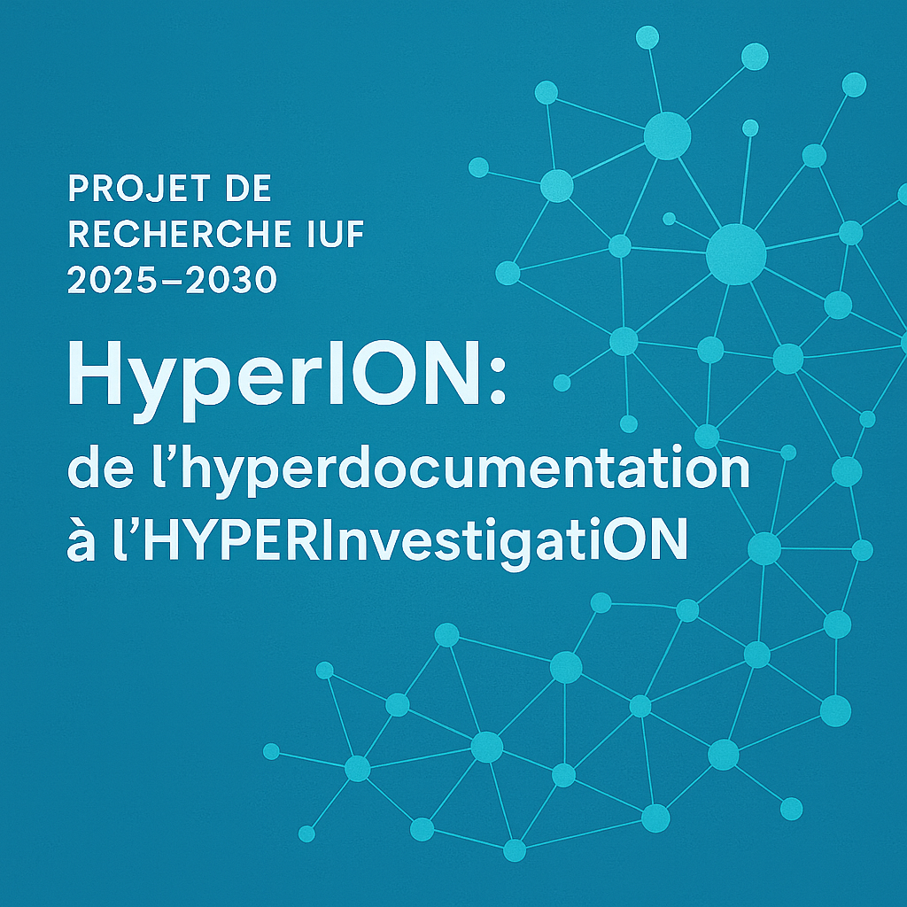

# PROJET DE RECHERCHE IUF 2025-2030 : HyperION : de l’hyperdocumentation à l’HYPERInvestigatON

Le projet HyperIon explore les méthodes et technologies de l'hyperinvestigation, un concept qui allie investigation en ligne et l’ingénierie logicielle et documentaire qui est mobilisée.
L’approche épistémologique d’HyperION repose sur un travail conceptuel qui articule le concept d’hyperinvestigation avec celui d’hyperdocumentation. Nous avons cherché à montrer l’acuité actuelle de ce concept créé par Paul Otlet en 1934 dans notre ouvrage éponyme publié en 2021 (Le Deuff, 2021). Notre approche se situe au sein des sciences de l’information et de la communication et opère une démarcation par rapport aux discours dominants en matière numérique et médiatique qui privilégient les effets de mode successifs autour de la société de l’information, de l’ère du numérique, des big data ou de l’intelligence artificielle. Nous avons au contraire montré la pertinence du concept de document et la nécessité de l’articuler avec les travaux en matière de recherche d’information et d’évaluation de l’information.
L’hyperinvestigation renvoie aux méthodes et nouvelles formes d’investigation qui s’appuie sur des outils numériques notamment ceux de l’OSINT (Open source Intelligence) que d’aucuns préfèrent également qualifier d’investigations en ligne ou d’investigations audiovisuelles. Nous choisissons à dessein de les regrouper sous le terme d’hyperinvestigation pour des raisons conceptuelles et épistémologiques. 
Ces réalisations reposent sur des méthodologies et technologies de recherche et de traitement de l’information qui permettent d’opérer des déductions, des reconstitutions, des constructions narratives que nous souhaitons étudier. Le concept d’hyperinvestigation permet de regrouper dans un même cadre des enquêtes, des méthodes et des technologies, y compris celles qui mobilisent de l'IA, tout en étudiant les documents produits et en conservant la pertinence de la théorie des documents, en particulier dans des contextes liés à la qualité de l’information. Le projet s’inscrit dans le prolongement de projets précédents, notamment celui d’observatoire de l’OSINT ou Osintoscope  que nous avons monté grâce à un soutien d’amorçage de notre université (PSE 2024), complété par un projet de recherche financé par l’IHEMI (Institut des hautes études du ministère de l’Intérieur) intitulé MatrioscIA (MATRIce OSint pour les Cas d'usage de l'IA, 2024-2025) dont le but est d’étudier  les évolutions des méthodologies OSINT en lien avec le développement des technologies de l’IA. L’OSINT désigne de façon générale les méthodes, outils et analyses qui se basent sur des informations directement accessibles en ligne (Le Deuff, 2021a). Différents acteurs utilisent et mobilisent l’OSINT dans leur domaine professionnel ou à titre amateur. La popularité croissante de ces méthodes et outils nécessite une étude approfondie pour comprendre les tendances, enjeux et risques associés.
Le titre du projet HyperION est une référence à l’ouvrage éponyme de Dan Simmons qui décrit en 1989 une infosphère (datasphere en anglais) qui pourrait s’apparenter à notre web actuel. L’ouvrage est lui-même une référence au poème de John Keats qui décrit la volonté des Titans de prendre leur revanche. Hyperion renvoie donc à des formes de quêtes complexes, entre utopie et poésie. Ce choix rentre en adéquation avec le concept d’hyperdocumentation dont la logique chez Paul Otlet repose également sur des logiques « titanesques » (Le Deuff, 2021b) que vient rappeler l’œuvre symboliste Prométhée de Jean Deville qui fut accrochée longtemps au Palais Mondial de Bruxelles, lieu du Mundaneum de Paul Otlet. 

## 1. Articuler hyperdocumentation et hyperinvestigation
Alors que les discours dominants tendent à se centrer sur les données et l’IA, notre proposition est de considérer que les formes documentaires demeurent importantes tant dans la collecte que dans la production en ce qui concerne les enquêtes de type journalistique. L’hyperinvestigation s’appuie ainsi sur les formes de l’hyperdocumentation.
Si Paul Otlet définissait l’hyper-documentation comme une forme d’état ultime de la documentation où tout serait potentiellement documenté notamment l’ensemble des sens humains (Otlet, 1934, Le Deuff, Perret, 2020), nous avons montré que le concept pouvait se concrétiser au sein des environnements numériques actuels (Le Deuff, 2021). À cet effet, nous avons choisi de retirer le trait d’union pour montrer l’acuité contemporaine du concept tant les actions de documentation s’accroissent dans le contexte des nouvelles formes d’investigation contemporaine qu’elles soient menées par des journalistes, des ONG, des services de renseignements ou d’intelligence économique de type due diligence.
Il convient à cet effet de mieux saisir les sens que l’on peut donner au préfixe hyper qui doit être compris à plusieurs titres. Le préfixe "hyper" indique une extension des possibilités de traitement des documents et une augmentation des facultés analytiques. L'hyperdocumentation augmente les formats documentaires pris en compte, en cherchant à documenter une diversité d'activités et de types de documents, comme les moteurs de recherche qui indexent divers formats au-delà des pages HTML, pour couvrir un maximum d'actions et d'événements. Il n’y a donc pas de disparition des documents au profit que tout ne serait devenu que données, mais de nouvelles configurations qui permettent d’envisager des formes innovantes. En matière d’hyperinvestigation, le préfixe hyper marque à la fois l’augmentation des méthodes et des potentialités d’enquête en ligne ainsi que les nouvelles formes produites qui se composent d’une diversité de documents multimédias.
Au sein des sciences de l’information et de la communication, cette articulation entre hyperdocumentation et hyperinvestigation revient à associer plus étroitement deux traditions scientifiques différentes:
- Celle des sciences de l’information dont les racines sont celles des sciences bibliographiques et de la documentation. Nous avons consacré plusieurs travaux à ces aspects depuis le début de notre carrière avec notamment le projet ANR HyperOtlet (2017-2022) à propos de l’œuvre de Paul Otlet et plus particulièrement du Traité de Documentation, livre fondateur de la documentation et souvent cité comme référence de base dans l’histoire des sciences de l’information. Nous avons poursuivi ces travaux épistémologiques en nous intéressant à d’autres théoriciens et théoriciennes notamment Robert Pagès qui a été l’élève de Suzanne Briet, l’autre grande théoricienne de référence du domaine. Ce travail s’est effectué dans le cadre d’un projet franco-américain mené avec le spécialiste de l’histoire et de l’épistémologie des sciences de l’information et de la documentation, Michael Buckland. D’une manière générale, ce sont l’ensemble des travaux qui considère le document comme un concept clef et toujours actuel qui nous intéresse notamment avec les travaux de Ferraris en philosophie et le groupe de chercheurs qualifiés parfois de « néo-documentalists » autour notamment du réseau DOCAM (Document Academy).
- Celle des sciences des médias (media studies) et des études journalistiques. Nous nous sommes intéressé à ces domaines de façon plus marginale, l’étudiant notamment durant notre thèse sur la culture de l’information notamment quand il s’agissait d’articuler les différentes conceptions du mot information et les tensions qui en résultent en matière de formation, comme dans le cas présent avec l’Éducation aux médias et à l’information. À la suite de ce travail, nous avions considéré le fait qu’il fallait concevoir le journalisme comme une ingénierie à laquelle il fallait former de façon plus précoce. Récemment, en associant plus étroitement les traditions documentaires et journalistiques, nous avons travaillé sur le domaine de l’OSINT. Le concept d’OSINT s’est développé dans les secteurs du renseignement avant de s’étendre à celui de l’investigation en ligne menée par des acteurs du journalisme et des ONG, notamment des acteurs spécialisés comme Bellingcat. Nous avons publié des articles dédiés en collaboration avec Rayya Roumanos et produit un graphe en ligne sur les acteurs du domaine avec l’Osintosphère  en 2021.

## 2.	Étudier l’hyperinvestigation 
Cette articulation conceptuelle entre hyperdocumentation et hyperinvestigation nous permet d’aborder les questions informationnelles et médiatiques avec un angle nouveau afin de mieux saisir les nouvelles pratiques journalistiques qui se développent à l’heure actuelle autour des méthodes d’investigations visuelles et de type OSINT. Cette dimension s'inscrit dans les recherches récentes que nous avons menées au cours des cinq dernières années, en explorant un domaine scientifique qui, jusqu'à présent, était marginal dans nos travaux : le domaine médiatique, et plus précisément le journalisme d'investigation.
Nous proposons d’étudier l’hyperinvestigation au travers des trois axes suivants :

### 2.1. Retracer et définir l’épistémologie de l’hyperinvestigation 
L’articulation entre hyperdocumentation et hyperinvestigation mérite un travail épistémologique qui consiste à dépasser la période récente pour examiner des évolutions et des travaux précurseurs. Les connexions entre les concepts d’information, de documentation et d’investigation seront ici l’objet d’un examen approfondi. Nous avons identifié plusieurs pistes d’étude notamment les travaux de Lodewyk Bendikson (1875-1953) de la Huntington Library, à San Marino, en Californie qui méritent une étude approfondie. Son travail pionnier dans des méthodes qu’on pourrait qualifier de « forensiques » lui a permis de développer des procédés documentaires photographiques basés sur des techniques de reproduction, de conservation et d'analyse des documents (photostats, microcartes, microfilms). Son utilisation des rayons infrarouges, ultraviolets et fluorescents pour l'analyse des documents endommagés et altérés a donné lieu à une première étude (Buckland, 2012). Nous souhaitons travailler sur cette piste avec notre collègue de Berkeley, Michael Buckland avec qui nous avons précédemment travaillé sur Robert Pagès lors d’un projet Fondation Berkeley-France (2021-2023).
Cette approche historique et épistémologique s’inscrit dans des démarches de type « archéologie des médias » avec des approches par strates en montrant que le besoin d’identifier les évolutions et transformations d’un document imprimé et les éventuelles falsifications débute bien avant les technologies informatiques. Nous souhaitons poursuivre ici notre démonstration que les humanités numériques doivent être plutôt considérées comme des humanités digitales et qu’elles s’inscrivent dans une histoire longue : celles des méthodes et outils d’indexation et de repérage des informations et des savoirs (Le Deuff, 2017).

### 2.2 Étudier les méthodologies de l’hyperinvestigation
L’axe central du projet HyperIon repose sur la constitution d’un corpus d’investigation de type OSINT et d’enquêtes visuelles, l’analyse des méthodes et outils déployés ainsi que la construction du récit qui en résulte. Ce travail s’accompagnera d’une série d’entretiens auprès des acteurs et auteurs de ces travaux. Nous avons déjà identifié et interrogé une première série d’acteurs avec Rayya Roumanos pour la publication du numéro spécial OSINT d’I2D dirigé avec Rayya Roumanos. Ce travail s’inscrit dans le prolongement du projet d’observatoire de l’OSINT (Osintoscope) que nous avons monté en 2024 et qui a notamment pour but de développer une typologie des méthodes OSINT avec une focale spécifique sur les investigations notamment journalistiques ou menées par des ONG. Cet axe prolongera également notre étude sur l’utilisation des technologies d’intelligence artificielle dans ce type d’investigations.dans le cadre du projet MatrioscIA.
Le projet HyperION contient également une dimension éthique en ce qui concerne les méthodes et technologies déployées, à la fois en ce qui concerne l’utilisation de technologies d’intelligence artificielle qui font débat comme la reconnaissance faciale, mais aussi quant aux positionnements quant à l’utilisation de données personnelles.
Le mot OSINT fait désormais également débat. Une approche tente de marquer une rupture avec le monde des renseignements au profit d’une vision défendue par les ONG comme Bellingcat et des journalistes des cellules d’investigation notamment audiovisuelles. Des expressions comme open source investigation ou open source information for investigation sont de plus en plus fréquemment employées pour montrer cette démarcation. Cependant, des approches technologiques et méthodologies proches notamment en matière de recherche d’information en ligne sont constatables. Quelle que soit au final l’expression retenue, notre proposition est de considérer les méthodes d’OSINT comme des formes d’hyperinvestigation qui reposent sur des formes d’hyperdocumentation dans la mesure où il s’agit de dépasser les cadres habituels de l’évènement pour s’inscrire dans des registres qui sont ceux du document. Il faut comprendre le document au sens de « la preuve à l’appui d’un fait » (tradition documentaire impulsée par Suzanne Briet, etc.), mais également en tant qu’anti-évènement (Escarpit, 1976), ce qui inscrit l’hyperinvestigation dans des dimensions mémorielles tant il s’agit de dépasser la simple narration d’un fait divers.
Cette partie du projet requiert des déplacements dans les lieux stratégiques de l’hyperinvestigation que nous avons identifiés. Nous envisageons de nous rendre et passer du temps en immersion avec les acteurs de Bellingcat, de Forensic Architecture, du Centre for Information Resilience, de Tactical Tech et de mener des entretiens avec des acteurs dont les enquêtes constituent de bons exemples d’hyperinvestigation. Ce travail réclame un temps conséquent pour nous permettre de rencontrer les acteurs identifiés. Nous effectuerons ces déplacements soit seul, soit en compagnie de membres de l’observatoire de l’OSINT (Rayya Roumanos, Ugo Verdi, Clément Borel, etc.). Nous prévoyons également d’inviter des acteurs et des chercheurs et des acteurs du domaine du côté de Bordeaux Montaigne. Nous envisageons pour cela de déposer des projets de recherche complémentaires pour mener à bien ce travail afin de bénéficier de séjours invités ainsi que d’ingénierie complémentaire pour nous aider à réaliser des entretiens.
Le recrutement de stagiaires a également été budgété afin de faciliter le travail de collecte et de traitement de données. Nous souhaitons également en profiter pour former des étudiants intéressés par cette thématique, qui projetteraient de mener des recherches sur ces questions (master 2 ou thèse) et qui pourront être recrutés par la suite dans le cadre de projet de plus grande ampleur comme un projet ERC.

### 2.3 Montrer l’émergence d’un journalisme hyperdocumenté
Nous avons proposé en 2021 avec Rayya Roumanos (Roumanos, Le Deuff 2021a et 2021b) d’étudier la perspective d’un journalisme hyperdocumenté en rapprochant les enjeux journalistiques et l’hyperdocumentation dans le contexte de l’OSINT. Le concept proposé par Mor et Reich (Mor et Reich, 2018), sans en référer néanmoins à Paul Otlet, constatait l’augmentation de la pratique de rendre disponible des sources au sein même de l’article avec des documents intégrés qu’il était possible de consulter. Cette pratique n’est qu’une des facettes de ce que nous définissons comme un journalisme hyperdocumenté. 
Il faut comprendre le journalisme hyperdocumenté comme exemple d’hyperinvestigation dans un triple registre :
- Le premier est celui de l’augmentation des potentialités techniques de l’investigation du fait d’un accès accru à une série de données en accès ouvert ou non, en utilisant des techniques simples de récupération d’informations via des requêtes optimisées sur les moteurs de recherche (google dorks) jusqu’à des formes plus complexes mobilisant par exemple l’IA et les reconnaissances de forme. 
- Le second est celui de l’accroissement des territoires d’investigation dans la mesure où il s’agit également d’aller enquêter sur des formes numériques complexes. Cela peut concerner par exemple les systèmes algorithmiques. L’hyperinvestigation requiert alors un accroissement des compétences informationnelles et numériques et plus particulièrement de la littératie des données et des algorithmes. Le projet AlgoJ (2021-2024) que nous avons mené avec Rayya Roumanos s’inscrivait dans cette perspective, et nous souhaitons la poursuivre.
- Le troisième est celui du dépassement de la logique de l’évènement pour s’inscrire dans des temporalités plus longues et des portées plus ambitieuses et qui peuvent présenter une dimension mémorielle. Les travaux que nous avons menés sur le massacre de Boutcha par l’armée russe montrent que l’investigation de l’équipe de New York Times a cherché à dépasser le seul retour sur le tragique évènement pour envisager une portée plus ambitieuse. L’évènement ainsi hyperdocumenté acquière une nouvelle portée pour devenir un lieu de mémoire journalistique.

## 3. Développer une ingénierie technologique de l’hyperinvestigation 
Les enjeux logiciels font pleinement partie du projet, autant dans sa partie observation des outils mobilisés que dans la possibilité de produire des instruments dédiés.
### 3.1 Observer et produire
En ce qui concerne la partie observation, il s’agira d’étudier l’offre existante dans le domaine de l’OSINT et de l’investigation journalistique notamment celle qui consiste à « documenter » les évènements et les faits. Nous nous intéresserons particulièrement aux dispositifs permettant d’« hyperdocumenter » les crimes de guerre ou des violences. Le logiciel conçu par Forensic Architecture a permis par exemple de documenter les violences policières aux États-Unis lors de Black Lives Matter. Le même type de dispositif est utilisé pour recenser et localiser les crimes de guerre en Ukraine. Nous prévoyons d’utiliser ce dispositif pour cartographier les exemples d’hyperinvestigation que nous souhaitons étudier. Cette partie « observation » bénéficiera des résultats du projet MatrioscIA en ce qui concerne l’utilisation de technologies d’intelligence artificielle dans les méthodes de type OSINT. Au vu de la durée du projet, l’évolution des méthodes et outils s’appuyant sur les technologies de type IA fait partie des éléments clefs à prendre en compte.
En ce qui concerne la partie « production », nous nous inscrivons dans la logique des digital humanities dont un des buts est la production d’instruments pensés par les chercheurs et pour les chercheurs. Il s’agira aussi d’envisager une innovation sociale afin que les instruments réalisés puissent être mis à disposition sous licence open source à des acteurs de l’OSINT, du data journalisme, de l’investigation en ligne et de l’éducation, etc.
Cette dimension logicielle s’inscrit dans la continuité de notre objectif épistémologique d’articuler la fiche et le graphe. La fiche représentant un élément basique et historique de la documentation avec une partie métadonnées et une partie description, tandis que le graphe renvoie aux potentialités numériques et notamment du web en sortant des limites des arborescences pour faciliter les liaisons entre éléments via les possibilités hypertextuelles. Cette relation entre concept et logiciel fait partie de la philosophie de l’axe E3D du laboratoire MICA, axe que je codirige depuis septembre 2023 avec Nathalie Pinède. 
HyperION va pouvoir s’appuyer sur nos expériences et réalisations précédentes. Durant le projet HyperOtlet (2017-2021), nous avions envisagé avec Bertrand Müller cette logique avec le logiciel OMEKA S qui avait bénéficié d’une surcouche graphique dédiée . Durant ce même projet, nous avions également pu développer un premier prototype logiciel avec l’Otletosphère  dont le but était de représenter le réseau de Paul Otlet sous forme de graphes et de fiches. Cette réalisation logicielle open source a permis par la suite d’autres déclinaisons avec notamment la réalisation d’une Osintosphère mentionnée précédemment. Puis à l’initiative de notre doctorant Arthur Perret, un nouveau logiciel est issu de l’Otletosphère pour produire des graphes à partir de plusieurs types de documentation basée sur des fiches sous format markdown ou des données sous forme de tableur. Ce logiciel est devenu par la suite Cosma (Perret et ali. 2024) qui a évolué progressivement pour être actuellement disponible sous licence open source et en ligne de commande. 
### 3.2 Développer une version Hyperinvestigation de Cosma.
Dans le cadre d’HyperIon, nous allons poursuivre le développement de Cosma afin d’envisager une version dédiée à l’hyperinvestigation avec des fonctionnalités spécifiques. Cela donnera lieu à un livrable logiciel : Cosma Skritch, le skritch étant une référence à un personnage d’Hyperion de Dan Simmons. Le but est de parvenir à adjoindre à la dimension actuelle du graphe et des fiches, la possibilité d’ajouter des documents consultables. Esthétiquement, les documents seraient en quelques sortes « épinglés » au sein du graphe.
Le principe de l’hyperinvestigation repose sur les possibilités d’association et de mise en relation. Si depuis quelques années, les recherches ont privilégié l’automatisation des liens par des méthodes de scraping et d’extraction de données via des API couplées avec des visualisations via des logiciels comme Gephi, notre approche favorise le qualitatif au quantitatif dans une approche documentaire. Les approches automatisées via des API ont reposé sur des logiques de nature réputationnelle ou des méthodes d’analyse des controverses. Leur intérêt repose sur des logiques interprétatives a posteriori pour comprendre les clusters et hubs qui s’affichent sur la cartographie. Notre approche documentaire intègre une analyse et une interprétation continue au fur et à mesure de la constitution du graphe. Cela ne signifie pas que cette approche rejette des mécanismes qui permettraient de mettre à jour des liens entre des entités, mais qu’elle cherche surtout à préciser et à sémantiser les liens qui existent entre deux éléments. 
Cette approche cherche donc à éviter deux obstacles :
- la mise en avant de liens improbables et peu étayés, mais qui peuvent produire des effets loupe qui déforment la réalité.
- l'idée que tout peut être potentiellement lié ce qui pourrait s’apparenter à une logique conspirationniste. Notre approche, cependant, propose de considérer que les liens peuvent aussi bien être des liens d'opposition que d'amitié, et qu'il est important de les représenter graphiquement de manière différente. L'idéal documentaire consiste à justifier chaque lien et à en préciser la nature, en se basant sur des faits documentés. Nous espérons ainsi que l’innovation logicielle puisse constituer une innovation sociale en matière de lutte contre la désinformation. Une réflexion épistémologique, juridique et éthique accompagnera ce travail en ce qui concerne le fait qu’un document puisse apporter une preuve.
### 3.3 Offrir de nouvelles potentialités d’accès à l’instrument Cosma
Cette relation entre concept et logiciel, entre document et instrument s’inscrit dans des travaux précédents et des exemples de succès en matière d’ingénierie logicielle qui nous semble pertinents à suivre. Par exemple, le Knight Lab offre des outils en ligne de visualisation de données qui sont fortement utiles à des data journalistes, chercheurs, formateurs ou étudiants. Le fait de faire reposer l’architecture logicielle en mode cloud hébergé libère les usages potentiels des compétences et des temps nécessaires pour installer et s’approprier le logiciel qui est pour le moment en ligne de commande. Dans l’idéal, nous aimerions pouvoir héberger l’infrastructure technique du logiciel directement sur le cloud pour en faire bénéficier un plus grand nombre d’usagers qui seraient dispensés d’un certain nombre de compétences techniques liées à la ligne de commande. Nous songeons à poursuivre le développement des enjeux logiciels dans ce cadre en lien avec la TGIR Humanum. Un travail est d’ailleurs en cours pour envisager une liaison entre le logiciel d’écriture scientifique Stylo et Cosma dans le cadre d’un projet piloté par Marcello Vitali-Rosati de l’Université de Montréal. Le projet Revue3.0 auquel nous participons vient d’être financé par le Canada pour sept ans et envisage le renouvellement des dispositifs de types revues en ligne. L’articulation entre Stylo et Cosma fait partie de ces pistes d’innovation. Un séjour à Montréal est prévu pour faire avancer les travaux entre les équipes de Marcello Vitali-Rosatti de l’Université Montréal dans la liaison entre le logiciel d’écriture d’article scientifique Stylo et Cosma. 
La partie logicielle du projet continuera d’être assurée sous la direction d’Arthur Perret, actuellement maître de conférences à Lyon 3, avec Guillaume Brioudes comme développeur principal et le renfort de Clément Borel. L’équipe a développé des habitudes de travail depuis plusieurs années, ce qui permet d’assurer la réussite du développement du logiciel et ses réutilisations par des tiers .

### 4. Bibliographie des références citées dans le projet 

- Briet, S. (1951). Qu’est-ce que la documentation? Éditions documentaires, industrielles et techniques.
- Buckland, M. K. (2012). Lodewyk bendikson and photographic techniques in documentation, 1910–1943. In T. Carbo & T. B. Hahn (Éds.), International perspectives on the history of information science and technology worldwide (p. 99 106). Information Today.
- Escarpit, R. (1976). Théorie générale de l’information et de la communication. Hachette Université.
- Le Deuff, O. (2017). Les humanités digitales. Hermes Science Publishing Ltd.
- Le Deuff, O. (2021). Hyperdocumentation. Iste Editions.
- Le Deuff, O. (2021b). L’Open source intelligence (OSINT) comme prisme hyperdocumentaire. I2D-Information, donnees documents, 1, 56 62.
- Le Deuff, O. (2021c). L’homme fluidique ou hyper-homme chez Paul Otlet (1868-1944). Une perspective transhumaniste complexe. Revues des Sciences Humaines, 341, Transhumanisme et Fictions posthumanistes.
- Le Deuff, O., & Perret, A. (2019). Hyperdocumentation : Origin and evolution of a concept. Journal of Documentation.
- Le Deuff, O., & Roumanos, R. (2021). Open source intelligence (OSINT) : Retour aux sources. I2D-Information, donnees documents, 1, 8 12.
- Mor, N., & Reich, Z. (2018). From « trust me » to « show me » journalism. Journalism Practice, 12(9), 1091 1108. https://doi.org/10.1080/17512786.2017.1376593
- Otlet, Paul. (1934). Traité de documentation : Le livre sur le livre : Théorie et pratique, (éditiones Mundaneum).
- Perret, A., Brioudes, G., Borel, C., & Le Deuff, O. (2024). Cosma (Version 2.4.1) [Logiciel]. Zenodo. https://doi.org/10.5281/zenodo.11544741
- Roumanos, R., & Le Deuff, O. (2021a). L’enquête OSINT. Des traces ouvertes au récit journalistique fermé. Revue Intelligibilité du numérique, 2. http://intelligibilite-numerique.numerev.com/numeros/n-2-2021/2621-enquete-osint-des-traces-ouvertes-au-recit-journalistique-ferme
- Roumanos, R., & Le Deuff, O. (2021b). S’extraire de l’immédiateté de l’événement ou la tentation d’un « journalisme irréductible ». Communication. Information médias théories pratiques, Vol. 38/1, Article Vol. 38/1. https://doi.org/10.4000/communication.13925

